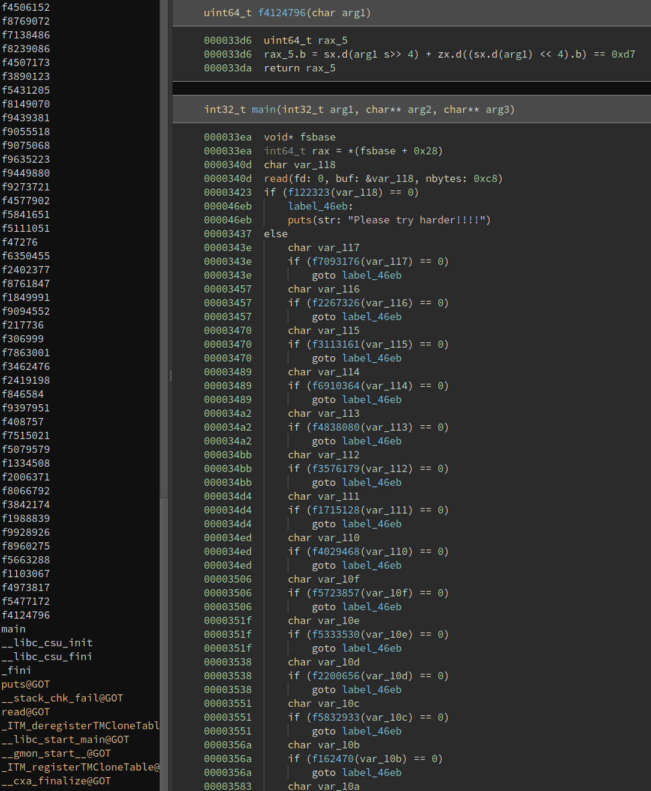

#### Notes:

- This will be a very short write-up because I just wanted to document my first time using angr
- Given a binary containing 200 functions, the goal is to input the correct flag
- Each character gets passed in a function containing various constraints
- We could solve this with Z3 as well but it would take a longer time



#### PoC:

- After specifying input length and adding valid bytes to our solver, we add our "win" message to the simulation manager and let it run

```Python

import angr, claripy

input_len = 200

proj = angr.Project('rev')

stdin = claripy.BVS('flag', 8 * input_len)
state= proj.factory.entry_state(stdin=stdin)

for x in range(input_len):
    state.solver.add(stdin.get_byte(x) >= 33)
    state.solver.add(stdin.get_byte(x) <= 126)

simgr = proj.factory.simulation_manager(state)
simgr.explore(find=lambda s: b'Congrats!!! You have cracked my code.' in s.posix.dumps(1))

print(simgr.found[0].posix.dumps(0).decode()) # input
print(simgr.found[0].posix.dumps(1).decode()) # output

# darkCON{4r3_y0u_r34lly_th1nk1n9_th4t_y0u_c4n_try_th15_m4nu4lly???_Ok_I_th1nk_y0u_b3tt3r_us3_s0m3_aut0m4t3d_t00ls_l1k3_4n9r_0r_Z3_t0_m4k3_y0ur_l1f3_much_e4s13r.C0ngr4ts_f0r_s0lv1in9_th3_e4sy_ch4ll3ng3}

# lol angr is busted

```
And thats it! Hope to do more complex stuff with angr in the future